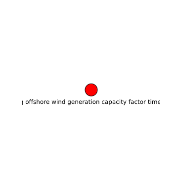

Existing offshore wind generation capacity factor time series 
==============================================================

# description
  
time series of 1 hour intervals from 1980-2020 of off shore wind generation per country in the EU
## keywords

||
| :--- |
|[offshore](252e7a88-1aca-4482-bda3-0ae0f9e39f5e.md)|
|[wind](795464ae-ecea-4a09-a356-10de61adcc08.md)|
|[time series](aad218bd-878a-42ca-8527-8f38e5acba36.md)|
|[capacity factor](dd9e1c57-2223-467c-a3d5-9c8701d3e688.md)|

## Publisher

|||
| :--- | :--- |
|Publisher|https://data.dtu.dk|
|Contact|nan|

## About the data

|||
| :--- | :--- |
|last modified|nan|
|spatial cover|EU|
|temporal cover|1980-01-01 00:00:00 - 2021-12-31 00:00:00|
|version|None|

## Data lineage

|was derived from|
| :--- |
|no lineage information available|
  

## License

CC BY 4.0
## Distributions

|identifier|format|version|last modified|access url|
| :---: | :---: | :---: | :---: | :---: |
|302c01ee-ead7-4e79-a12e-0d9e4c042702|csv|nan|nan|[None](None)|

## Data Quality

|metric|value|time of evaluation|dimension|
| :---: | :---: | :---: | :---: |
