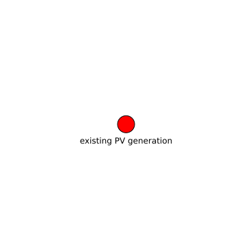

existing PV generation
======================

# description
  
time series of 1 hour intervals from 1980-2020 of rooftop solar generation per country in the EU
## keywords

||
| :--- |
|[solar](692e399d-78ff-4e06-88b4-9aa5086c48fa.md)|
|[PV](a3acd9db-fad8-4811-b26b-60b0535780ac.md)|

## Publisher

|||
| :--- | :--- |
|Publisher|https://data.dtu.dk|
|Contact|nan|

## About the data

|||
| :--- | :--- |
|last modified|nan|
|spatial cover|EU|
|temporal cover|1980-01-01 00:00:00 - 2021-12-31 00:00:00|
|version|None|

## Data lineage

|was derived from|
| :--- |
|no lineage information available|
  

## License

CC BY 4.0
## Distributions

|title|description|format|version|last modified|access url|
| :---: | :---: | :---: | :---: | :---: | :---: |

## Data Quality

|metric|value|time of evaluation|dimension|
| :---: | :---: | :---: | :---: |
