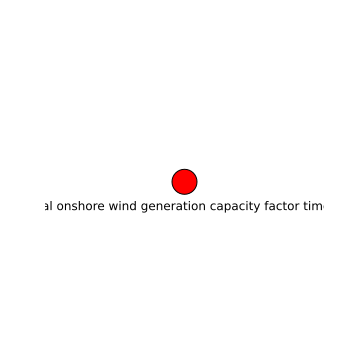

potential onshore wind generation capacity factor time series
=============================================================

# description
  
time series of 1 hour intervals from 1980-2020 of on shore wind generation per country in the EU
## keywords

||
| :--- |
|[wind](795464ae-ecea-4a09-a356-10de61adcc08.md)|
|[time series](aad218bd-878a-42ca-8527-8f38e5acba36.md)|
|[onshore](c4d053d9-fac7-4882-afcb-dfbdeff614ae.md)|
|[capacity factor](dd9e1c57-2223-467c-a3d5-9c8701d3e688.md)|

## Publisher

|||
| :--- | :--- |
|Publisher|https://data.dtu.dk|
|Contact|nan|

## About the data

|||
| :--- | :--- |
|last modified|nan|
|spatial cover|EU|
|temporal cover|1980-01-01 00:00:00 - 2021-12-31 00:00:00|
|version|None|

## Data lineage

|was derived from|
| :--- |
|no lineage information available|
  

## License

CC BY 4.0
## Distributions

|identifier|format|version|last modified|access url|
| :---: | :---: | :---: | :---: | :---: |
|0d6f644d-c719-4782-afd8-8a52d7dbfed0|csv|nan|nan|[None](None)|
|27c040f9-c844-4cbe-a40b-e38d631b2ed5|csv|nan|nan|[None](None)|
|2a6777d5-cdae-4220-bac2-50a62937f7e9|csv|nan|nan|[None](None)|
|3bef26bf-951d-43e1-ab28-b3b4e6161513|csv|nan|nan|[None](None)|
|8b079e47-58fa-4a59-959d-4f3f6fd2837e|csv|nan|nan|[None](None)|
|a202e800-939e-43f2-a9c7-a39c29268fb1|csv|nan|nan|[None](None)|
|aa958e50-43e9-4468-ad06-d79f8b0abd03|csv|nan|nan|[None](None)|
|ca4af6aa-74af-4b78-af4b-e27e54755a7d|csv|nan|nan|[None](None)|

## Data Quality

|metric|value|time of evaluation|dimension|
| :---: | :---: | :---: | :---: |
