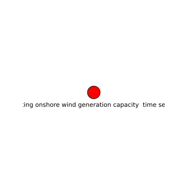

Existing onshore wind generation capacity  time series 
=======================================================

# description
  
time series of 1 hour intervals from 1980-2020 of on shore wind generation per country in the EU
## Publisher

|||
| :--- | :--- |
|Publisher|https://data.dtu.dk|
|Contact|nan|
|license|CC BY 4.0|

## About the data

|||
| :--- | :--- |
|last modified|nan|
|spatial cover|EU|
|temporal cover|1980-01-01 00:00:00 - 2021-12-31 00:00:00|

## Data Quality

|metric|value|time of evaluation|dimension|
| :---: | :---: | :---: | :---: |

## Data lineage

|was derived from|
| :--- |
|no lineage information available|
  

## Distributions

|identifier|format|version|last modified|access url|
| :---: | :---: | :---: | :---: | :---: |
|b6676761-db3e-4feb-9e44-2477be99cb33|csv|nan|nan|[None](None)|
