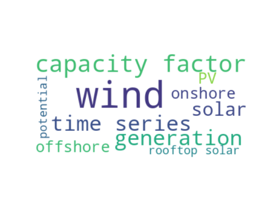

Mopo Data Catalog, European use case
====================================

Table of contents
=================

* [Description](#description)
	* [Publisher](#publisher)
	* [License](#license)
	* [keywords](#keywords)
* [Datasets organized by theme](#datasets-organized-by-theme)
	* [theme: [existing](3a13ede8-d139-4c62-bbdd-0f7537128ba8.md)](#theme-existing3a13ede8-d139-4c62-bbdd-0f7537128ba8md)
	* [theme: [rooftop solar](0a891426-5a92-4883-bf7e-773dd90a84b2.md)](#theme-rooftop-solar0a891426-5a92-4883-bf7e-773dd90a84b2md)
	* [theme: [potential](b6c79e59-01c4-49fd-b6da-066fc86e5715.md)](#theme-potentialb6c79e59-01c4-49fd-b6da-066fc86e5715md)
	* [theme: [offshore](252e7a88-1aca-4482-bda3-0ae0f9e39f5e.md)](#theme-offshore252e7a88-1aca-4482-bda3-0ae0f9e39f5emd)
	* [theme: [PV](a3acd9db-fad8-4811-b26b-60b0535780ac.md)](#theme-pva3acd9db-fad8-4811-b26b-60b0535780acmd)
	* [theme: [onshore](c4d053d9-fac7-4882-afcb-dfbdeff614ae.md)](#theme-onshorec4d053d9-fac7-4882-afcb-dfbdeff614aemd)
	* [theme: [solar](692e399d-78ff-4e06-88b4-9aa5086c48fa.md)](#theme-solar692e399d-78ff-4e06-88b4-9aa5086c48famd)
	* [theme: [generation](4fc79e59-01c4-49fd-b6da-066fc86e5715.md)](#theme-generation4fc79e59-01c4-49fd-b6da-066fc86e5715md)
	* [theme: [time series](aad218bd-878a-42ca-8527-8f38e5acba36.md)](#theme-time-seriesaad218bd-878a-42ca-8527-8f38e5acba36md)
	* [theme: [wind](795464ae-ecea-4a09-a356-10de61adcc08.md)](#theme-wind795464ae-ecea-4a09-a356-10de61adcc08md)
	* [theme: [capacity factor](dd9e1c57-2223-467c-a3d5-9c8701d3e688.md)](#theme-capacity-factordd9e1c57-2223-467c-a3d5-9c8701d3e688md)
	* [About this catalog](#about-this-catalog)

# Description

This is a data catalog to test different functions of the SimpleMDDataCatalog project  
[The machine readable version of the catalog (ttl) can be found here.](catalog.ttl)
## Publisher
  
mopo project
## License
  
cc-by-sa 4.0
## keywords

||
| :--- |
|[solar](692e399d-78ff-4e06-88b4-9aa5086c48fa.md)|
|[wind](795464ae-ecea-4a09-a356-10de61adcc08.md)|
|[capacity factor](dd9e1c57-2223-467c-a3d5-9c8701d3e688.md)|

# Datasets organized by theme
  
the word cloud gives a sense of the themes that are covered by the datasets in this data catalog.  
  
Here you will find datasets organized by theme. The headers of each theme are links you can click to learn more about the definition
## theme: [existing](3a13ede8-d139-4c62-bbdd-0f7537128ba8.md)

## theme: [rooftop solar](0a891426-5a92-4883-bf7e-773dd90a84b2.md)
  
[potential solar generatioon](d2046673-feca-41e3-9f5b-1c3bc6866129.md)
## theme: [potential](b6c79e59-01c4-49fd-b6da-066fc86e5715.md)
  
[potential solar generatioon](d2046673-feca-41e3-9f5b-1c3bc6866129.md)
## theme: [offshore](252e7a88-1aca-4482-bda3-0ae0f9e39f5e.md)
  
[Existing offshore wind generation capacity factor time series ](4241ad70-d5a3-4278-8ca2-15334dccf741.md)  
[potential offshore wind generation capacity factor time series](5b8b1db7-186c-4fab-9584-a87478e41c97.md)
## theme: [PV](a3acd9db-fad8-4811-b26b-60b0535780ac.md)
  
[existing PV generation](46be983d-3de3-4e10-b82a-828b18cd77e7.md)  
[potential solar generatioon](d2046673-feca-41e3-9f5b-1c3bc6866129.md)
## theme: [onshore](c4d053d9-fac7-4882-afcb-dfbdeff614ae.md)
  
[potential onshore wind generation capacity factor time series](e857840a-8b0a-491d-9e0b-b6789e28aea6.md)  
[Existing onshore wind generation capacity  time series ](f183c997-9f56-450b-88cc-86ac1eebc93a.md)
## theme: [solar](692e399d-78ff-4e06-88b4-9aa5086c48fa.md)
  
[Mopo Data Catalog, European use case](None.md)  
[existing PV generation](46be983d-3de3-4e10-b82a-828b18cd77e7.md)  
[potential solar generatioon](d2046673-feca-41e3-9f5b-1c3bc6866129.md)
## theme: [generation](4fc79e59-01c4-49fd-b6da-066fc86e5715.md)
  
[Existing offshore wind generation capacity factor time series ](4241ad70-d5a3-4278-8ca2-15334dccf741.md)  
[potential offshore wind generation capacity factor time series](5b8b1db7-186c-4fab-9584-a87478e41c97.md)  
[potential onshore wind generation capacity factor time series](e857840a-8b0a-491d-9e0b-b6789e28aea6.md)  
[Existing onshore wind generation capacity  time series ](f183c997-9f56-450b-88cc-86ac1eebc93a.md)
## theme: [time series](aad218bd-878a-42ca-8527-8f38e5acba36.md)
  
[Existing offshore wind generation capacity factor time series ](4241ad70-d5a3-4278-8ca2-15334dccf741.md)  
[potential offshore wind generation capacity factor time series](5b8b1db7-186c-4fab-9584-a87478e41c97.md)  
[potential onshore wind generation capacity factor time series](e857840a-8b0a-491d-9e0b-b6789e28aea6.md)  
[Existing onshore wind generation capacity  time series ](f183c997-9f56-450b-88cc-86ac1eebc93a.md)
## theme: [wind](795464ae-ecea-4a09-a356-10de61adcc08.md)
  
[Mopo Data Catalog, European use case](None.md)  
[Existing offshore wind generation capacity factor time series ](4241ad70-d5a3-4278-8ca2-15334dccf741.md)  
[potential offshore wind generation capacity factor time series](5b8b1db7-186c-4fab-9584-a87478e41c97.md)  
[potential onshore wind generation capacity factor time series](e857840a-8b0a-491d-9e0b-b6789e28aea6.md)  
[Existing onshore wind generation capacity  time series ](f183c997-9f56-450b-88cc-86ac1eebc93a.md)
## theme: [capacity factor](dd9e1c57-2223-467c-a3d5-9c8701d3e688.md)
  
[Mopo Data Catalog, European use case](None.md)  
[Existing offshore wind generation capacity factor time series ](4241ad70-d5a3-4278-8ca2-15334dccf741.md)  
[potential offshore wind generation capacity factor time series](5b8b1db7-186c-4fab-9584-a87478e41c97.md)  
[potential onshore wind generation capacity factor time series](e857840a-8b0a-491d-9e0b-b6789e28aea6.md)  
[Existing onshore wind generation capacity  time series ](f183c997-9f56-450b-88cc-86ac1eebc93a.md)
## About this catalog
  
This catalog was generated using the SimpleMDDataCatalog package that is is maintained [here](https://github.com/uuidea/SimpleMDDataCatalog).